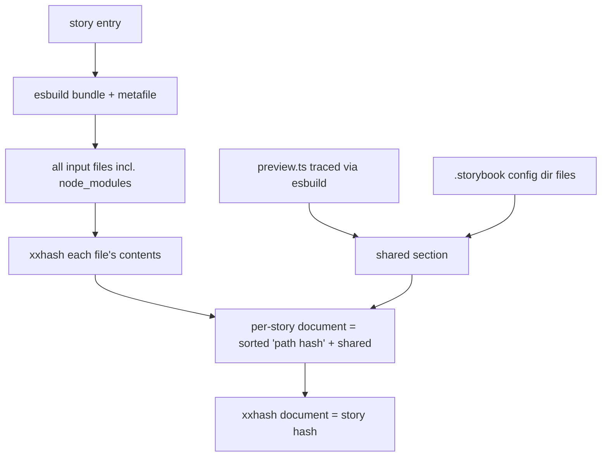
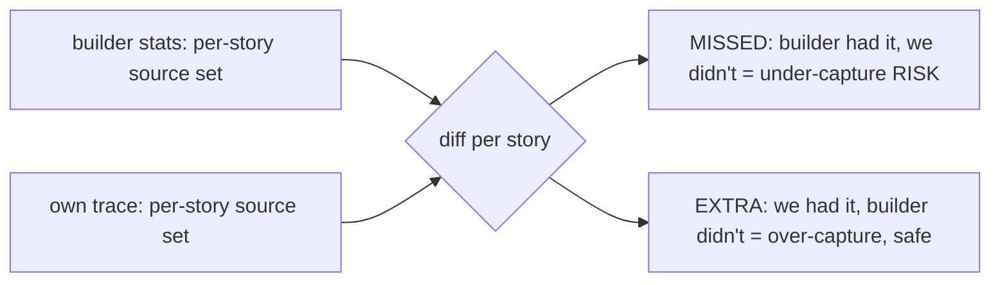
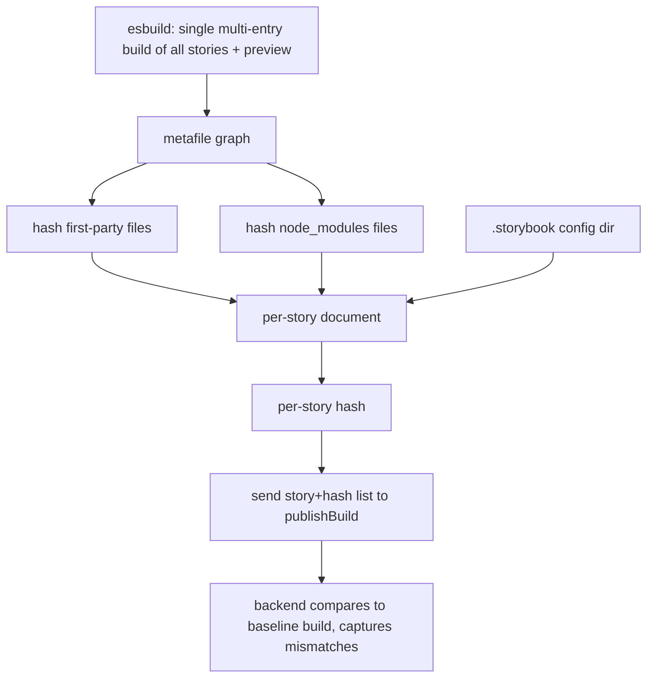

# Hash-based TurboSnap — Strategy A: own-trace (esbuild)

> Part of the [hash-based TurboSnap research](./hash-based-turbosnap.md). Read the main doc
> first for the goal, the hashing/diff core, the shared section, and the A-vs-B decision.
> **This document only covers what's specific to strategy A.**

**Strategy A traces the dependency graph ourselves**, independent of the builder, by
bundling each story with esbuild and reading the resulting input set. It is the
**recommended fallback** for builders we don't own (e.g. Rspack) and the prototype that
proved the hashing core works consistently across builders.

**Trade-off:** we must faithfully replicate each project's build config (aliases, plugins),
and fidelity drift is *silent* — a missed dependency means a real visual change gets
skipped. (Strategy B, where the builder emits the graph, makes that failure *loud* instead;
see the [main doc](./hash-based-turbosnap.md#the-two-options).)

## `hash-stories-esbuild` — own-trace with node_modules hashed

Bundles each story with esbuild and hashes **every** input file — first-party and
node_modules — with no version sniffing. Also traces the preview config via esbuild,
which closes the Vite preview-deps gap from the own-trace side.



**Output** — note node_modules files are real, hashed leaves (with transitive deps):

```
node-src/ui/components/icons.stories.ts [1daff1bafa1e960a] — 11 files (9 node_modules)
    node-src/ui/components/icons.stories.ts
    node-src/ui/components/icons.ts
    node_modules/ansi-styles/index.js
    node_modules/chalk/source/index.js
    node_modules/chalk/source/templates.js
    node_modules/chalk/source/util.js
    node_modules/color-convert/conversions.js
    node_modules/color-convert/index.js
    node_modules/color-convert/route.js
    node_modules/color-name/index.js
    node_modules/supports-color/browser.js

Shared section: 13 files (10 node_modules), appended to every story.
```

**Dependency-change detection** — editing `node_modules/chalk/source/index.js`:

```
Baseline diff: 115 need re-capture (115 changed, 0 added, 0 removed, 0 unchanged).
```

(chalk is used directly by most components and via the preview, so all 115 correctly
bust.) An unchanged baseline yields `0 need re-capture`.

This prototype bundles **per story**; a production version would use a single multi-entry
build plus caching (see [Performance / scaling](#performance--scaling) below).

## `trace-fidelity` — is an own-trace trustworthy?

Strategy A only works if an own-trace faithfully reproduces what the builder bundled. This
script quantifies the gap before we trust it. For each story it compares two **first-party
source** dependency sets:

- **STATS** — what the builder actually bundled (ground truth).
- **OWN** — what our tracer (esbuild or oxc) finds.



**`--resolver esbuild`** (default): bundle + metafile; esbuild compiles TS and tree-shakes.

```
Checked 115 stories against the builder stats (resolver: esbuild).

  Dependency coverage:  100.0% of stats deps found by own-trace
  Stories with misses:  0 / 115
  Unique missed files:  0
  Stories the resolver could not trace: 0
```

`esbuild: coverage 1 | total stats deps 416 | total EXTRA 0 | max extra/story 0` — perfect.

**`--resolver oxc`**: `oxc-parser` (import extraction) + `oxc-resolver` (resolution only).

```
oxc: coverage 1 | total stats deps 416 | total EXTRA 9176 | max extra/story 217
```

100% coverage (0 missed) but **~9,200 EXTRA** files — massive over-capture, concentrated
in a long tail (median 0/story, max 217). Root causes a bare resolver can't handle:

1. **Type-only imports written without the `type` keyword**, e.g.
   `import { Context } from '../types'` where `Context` is an interface. esbuild does
   TS-aware elision and drops it; a syntactic tracer follows it into the type barrel
   (`types.ts`) and pulls in the whole app graph (`git/*`, `bin-src/*`, …).
2. **Tree-shaking** of unused exports (especially through barrel files).

**Why strategy A is built on esbuild, not a bare resolver:** an own-trace needs
bundler-grade TS elision + tree-shaking. esbuild provides both for free; resolution alone
over-captures badly enough to defeat TurboSnap's purpose.

## End-to-end flow

The diagram below is the production-relevant shape of strategy A — a single multi-entry
build instead of the per-story loop the prototype uses. Everything from "per-story
document" onward is the shared hashing/diff core (see
[main doc](./hash-based-turbosnap.md)).



## Performance / scaling

> These numbers measure **strategy A specifically** — the cost of *bundling stories to
> trace them*. They do not apply to strategy B, where the graph and per-module hashes come
> out of the build Storybook already runs (no separate trace step).

Building the `storybookjs/storybook` monorepo's internal Storybook wasn't practical in the
research environment (Nx + yarn workspaces, and the esbuild tracer needs the source tree
*with node_modules installed* to bundle). Instead, scaling was measured with a controlled
benchmark: N synthetic-but-realistic stories, each importing a component that pulls a real
node_modules graph (`chalk` + transitive deps, `ts-dedent`) — comparable to the ~11–15
files per real story observed in this repo. Cold runs, no caching.

| Stories | Single multi-entry build | Per-story loop (current script) |
|--------:|-------------------------:|--------------------------------:|
|     115 |     219 ms (1.9 ms/story) |            1,135 ms (9.9 ms/story) |
|     500 |     840 ms (1.7 ms/story) |            4,753 ms (9.5 ms/story) |
|   1,000 |   2,880 ms (2.9 ms/story) |           11,015 ms (11.0 ms/story) |
|   2,000 |  10,644 ms (5.3 ms/story) |           27,613 ms (13.8 ms/story) |

Takeaways:

- **Per-story bundling** (what `hash-stories-esbuild` does today) scales roughly linearly
  at ~10–14 ms/story: a 2,000-story Storybook traces in ~28 s.
- **A single multi-entry build is ~2.5–5× faster** and is the production-relevant path
  (it shares esbuild startup and graph work). 2,000 stories in ~11 s.
- File hashing (xxhash) is **not** the bottleneck — bundling dominates; the 115-story real
  run completes in ~2 s including hashing.

Caveats: synthetic stories are smaller than many real-world stories, so real ms/story will
be higher; node_modules are re-parsed per entry here (a shared module graph / single build
amortizes that); and these are cold runs. In production we'd run once per build, cache file
hashes across builds, and only re-bundle changed entries — so steady-state cost is much
lower than these cold numbers.

## Open questions specific to strategy A

- Fidelity on non-vanilla setups: SVGR, CSS modules, `?raw`/`?url`, Vue/Svelte SFCs.
  `trace-fidelity` is the tool to measure this per project before trusting the own-trace.
- How to faithfully apply the user's bundler config (aliases, plugins) to the esbuild
  trace so the own-trace matches the real build.
