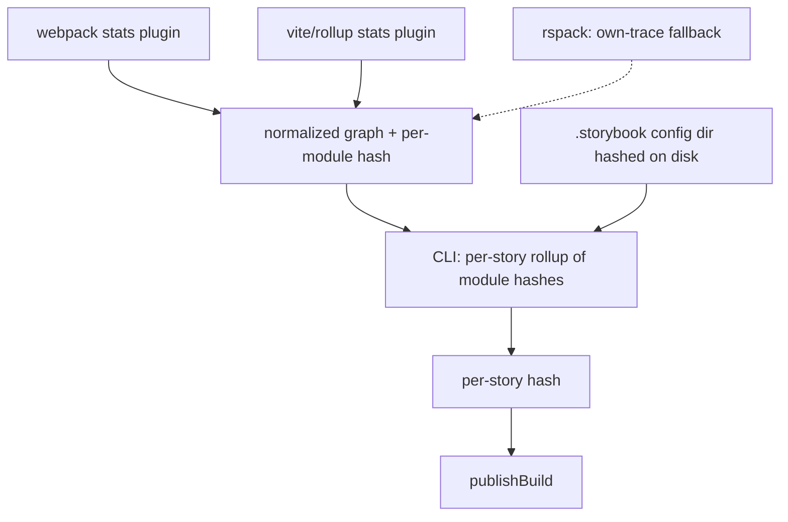

# Hash-based TurboSnap — Strategy B: emit the graph from the builder

> Part of the [hash-based TurboSnap research](./hash-based-turbosnap.md). Read the main doc
> first for the goal, the hashing/diff core, the shared section, and the A-vs-B decision.
> **This document only covers what's specific to strategy B.**

**Strategy B has the builder plugins emit a normalized dependency graph** — ideally with
per-module content hashes — and the CLI does pure graph-rollup + diff. It is the
**recommended production path for the builders we own (Vite and webpack5)**.

It stays builder-*dependent*, but the coupling is isolated to thin per-builder adapters
that emit one normalized format; everything downstream is a single builder-agnostic
algorithm.

## Why this is the preferred direction

We maintain 2 of the 3 relevant builders (Vite and webpack5; Rspack is community-
maintained), so keeping per-builder plugins up to date is acceptable — it's the **same
class of maintenance TurboSnap already carries**. The decisive advantages over an
own-trace ([strategy A](./hash-based-turbosnap-strategy-a-own-trace.md)):

- **Highest fidelity:** resolution, TypeScript type-elision, and tree-shaking come from the
  real build for free — no second bundler to keep faithful to the project's config.
- **Loud failure mode:** if extraction fails or the format changes, it breaks in CI.
  Strategy A's alternative is *silent* fidelity drift per project (under-capture = a real
  visual change skipped), which is worse.
- There are only 3 relevant builders and they're consolidating toward Vite/Rolldown.

So we reserve the own-trace for builders we don't own; for Vite and webpack5 we emit.



## What the plugins need to change (Vite and webpack5)

1. **Vite: stop dropping virtual-bridged edges (the preview gap).** In
   `@storybook/builder-vite`, `pluginWebpackStats` gates the graph through `isUserCode`,
   which excludes `\0`-prefixed virtual modules unless they're in a small allowlist. The
   chain to `.storybook/preview.*` and addon `preview` entries runs through the
   project-annotations / config-entry virtual, which is **not** in that allowlist — so
   those edges are dropped and `preview.*` is orphaned out of the stats (the Vite
   preview-deps gap; see
   [main doc → Builder stats are not portable](./hash-based-turbosnap.md#builder-stats-are-not-portable)).
   Fix: build the graph from Rollup's complete module info at `buildEnd`
   (`getModuleIds()` → `getModuleInfo(id)`), bridging *through* virtual modules (connect a
   virtual's real importers to its real imports) instead of filtering them out. This brings
   Vite to parity with webpack.
2. **Keep node_modules *files* in the graph** (already true for both builders) with stable
   resolved paths, so dependencies can be hashed at the file level — no version sniffing.
3. **Emit a stable per-module content hash** (detailed below) — the highest-leverage
   change.
4. **Normalize the schema across builders** so the downstream algorithm is single-path,
   e.g. `{ id, path, kind: 'source' | 'node_module' | 'external', importers: string[],
   contentHash? }`. Webpack/Rspack stats are already complete; the work is conforming to
   the schema.
5. **Out of band:** `.storybook/main.*` and manager/Node-side config never appear in the
   preview bundle graph, so keep hashing the `.storybook` config dir from disk (or add a
   separate manager-side stats). (This is shared with strategy A.)

## Per-module content hashing — detail

This is the change that collapses the CLI to a pure graph-rollup and removes every
fidelity problem. If each module in the graph carries a stable content hash, the CLI no
longer resolves imports, reads files, runs a second bundler, or sniffs node_modules
versions. Its whole job becomes:

```
storyHash(S) = H( sorted [(moduleId, moduleHash) for module in reachable(S)] + sharedSection )
```

…then diff `storyHash` maps against the baseline build.

**What to hash (the crux).** "Content hash" can mean three things, and the choice
determines correctness and stability:

| Option | Captures | Risk |
|---|---|---|
| Raw on-disk source bytes | source edits | misses config/transform-driven changes (a `define` value, plugin option, alias retarget, SVGR output) |
| Post-transform module code | the *actual bundled output* (best signal) | machine-dependent noise (absolute paths, sourcemap refs, timestamps) |
| **Post-transform code, normalized** (recommended) | bundled output | — (noise stripped before hashing) |

Normalize before hashing: strip absolute project/home paths → repo-relative, drop
sourcemap comments/inline maps, and be deliberate about `define`/env inlining (env that
affects visuals *should* invalidate; CI-noise env like build IDs should be excluded or
hashed pre-`define`).

**Where the material already exists** — this is cheap in both builders we own:

- **Rollup/Vite:** `ModuleInfo.code` is the transformed code per module. At `buildEnd`,
  iterate `getModuleIds()` → `getModuleInfo(id).code`, normalize, hash, emit alongside
  `importers`.
- **webpack:** it already computes content-based module hashes for `[contenthash]`
  (`chunkGraph.getModuleHash` / `module.buildInfo.hash`); surface those (confirm they're
  content- not identity-derived, and runtime-stable).

Use xxhash64 (fast, non-crypto; 128-bit if extra collision margin is wanted) — negligible
cost next to the build.

**Edge cases:**

- **Virtual modules** (no file): hash their *generated* content (the plugin produced it).
  Desirable — the stories-list virtual changes when stories are added/removed.
- **node_modules:** hashed like any module → catches version bumps, `patch-package` edits,
  and changed transitive resolution, with no version string to trust.
- **Assets / CSS:** hash the transform output (URL, base64, injected CSS) → captures
  asset/style changes that affect rendering.
- **Granularity:** hashing the whole module means a change to a tree-shaken-away export of
  a *used* module still invalidates — mild, safe over-capture; per-export precision isn't
  worth it.

**Capture characterization:**

- **Under-capture: ~zero.** Any in-graph input whose content changes re-hashes every
  dependent story.
- **Over-capture: mild, safe.** Whitespace/comment-only changes, or changes to unused
  exports of used modules, invalidate without pixel changes.
- The only under-capture surface is anything affecting rendering that **isn't a module in
  the graph** — global CSS injected via `preview-head.html`, fonts, runtime-fetched data —
  which is why the `.storybook` config dir is still folded in (point 5 above).

**Optional:** the plugin could emit per-story hashes directly, making the CLI a pure
pass-through to `publishBuild`. Still emit **module-level** hashes too, for flexible
backend rollups and for debuggability ("story X re-captured because module Y changed").

The one subtle thing to get right is the **normalization of transformed code** so the hash
is deterministic across machines and CI.

## Open questions specific to strategy B

- Confirming webpack's `[contenthash]` module hashes are content- (not identity-) derived
  and runtime-stable.
- Finalizing the normalized graph schema across builders.
- Whether the plugin emits per-module hashes only, or per-story hashes too.
