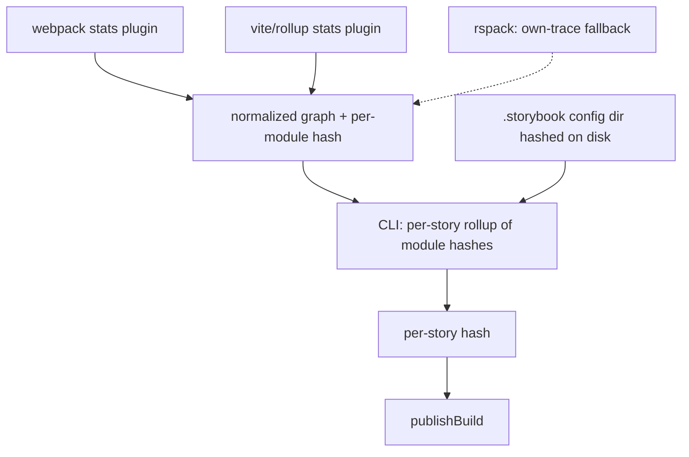

# Hash-based TurboSnap — Strategy B: emit the graph from the builder

> Part of the [hash-based TurboSnap research](./hash-based-turbosnap.md). Read the main doc
> first for the goal, the hashing/diff core, the shared section, and the A-vs-B decision.
> **This document only covers what's specific to strategy B.**

**Strategy B has the builder plugins emit a normalized dependency graph** — ideally with
per-module content hashes — and the CLI does pure graph-rollup + diff. It is the
**recommended production path for the builders we own (Vite and webpack5)**.

It stays builder-*dependent*, but the coupling is isolated to thin per-builder adapters
that emit one normalized format; everything downstream is a single builder-agnostic
algorithm.

## Why this is the preferred direction

We maintain 2 of the 3 relevant builders (Vite and webpack5; Rspack is community-
maintained), so keeping per-builder plugins up to date is acceptable — it's the **same
class of maintenance TurboSnap already carries**. The decisive advantages over an
own-trace ([strategy A](./hash-based-turbosnap-strategy-a-own-trace.md)):

- **Highest fidelity:** resolution, TypeScript type-elision, and tree-shaking come from the
  real build for free — no second bundler to keep faithful to the project's config.
- **Loud failure mode:** if extraction fails or the format changes, it breaks in CI.
  Strategy A's alternative is *silent* fidelity drift per project (under-capture = a real
  visual change skipped), which is worse.
- There are only 3 relevant builders and they're consolidating toward Vite/Rolldown.

So we reserve the own-trace for builders we don't own; for Vite and webpack5 we emit.



## What the plugins need to change (Vite and webpack5)

1. **Vite: stop dropping virtual-bridged edges (the preview gap).** In
   `@storybook/builder-vite`, `pluginWebpackStats` gates the graph through `isUserCode`,
   which excludes `\0`-prefixed virtual modules unless they're in a small allowlist. The
   chain to `.storybook/preview.*` and addon `preview` entries runs through the
   project-annotations / config-entry virtual, which is **not** in that allowlist — so
   those edges are dropped and `preview.*` is orphaned out of the stats (the Vite
   preview-deps gap; see
   [main doc → Builder stats are not portable](./hash-based-turbosnap.md#builder-stats-are-not-portable)).
   Fix: build the graph from Rollup's complete module info at `buildEnd`
   (`getModuleIds()` → `getModuleInfo(id)`), bridging *through* virtual modules (connect a
   virtual's real importers to its real imports) instead of filtering them out. This brings
   Vite to parity with webpack.
2. **Keep node_modules *files* in the graph** (already true for both builders) with stable
   resolved paths, so dependencies can be hashed at the file level — no version sniffing.
3. **Emit a stable per-module content hash** (detailed below) — the highest-leverage
   change.
4. **Normalize the schema across builders** so the downstream algorithm is single-path,
   e.g. `{ id, path, kind: 'source' | 'node_module' | 'external', importers: string[],
   contentHash? }`. Webpack/Rspack stats are already complete; the work is conforming to
   the schema.
5. **Out of band:** `.storybook/main.*` and manager/Node-side config never appear in the
   preview bundle graph, so keep hashing the `.storybook` config dir from disk (or add a
   separate manager-side stats). (This is shared with strategy A.)

## Per-module content hashing — detail

This is the change that collapses the CLI to a pure graph-rollup and removes every
fidelity problem. If each module in the graph carries a stable content hash, the CLI no
longer resolves imports, reads files, runs a second bundler, or sniffs node_modules
versions. Its whole job becomes:

```
storyHash(S) = H( sorted [(moduleId, moduleHash) for module in reachable(S)] + sharedSection )
```

…then diff `storyHash` maps against the baseline build.

**What to hash (the crux).** "Content hash" can mean three things, and the choice
determines correctness and stability:

| Option | Captures | Risk |
|---|---|---|
| Raw on-disk source bytes | source edits | misses config/transform-driven changes (a `define` value, plugin option, alias retarget, SVGR output) |
| Post-transform module code | the *actual bundled output* (best signal) | machine-dependent noise (absolute paths, sourcemap refs, timestamps) |
| **Post-transform code, normalized** (recommended) | bundled output | — (noise stripped before hashing) |

Normalize before hashing: strip absolute project/home paths → repo-relative, drop
sourcemap comments/inline maps, and be deliberate about `define`/env inlining (env that
affects visuals *should* invalidate; CI-noise env like build IDs should be excluded or
hashed pre-`define`).

**Where the material already exists** — this is cheap in both builders we own:

- **Rollup/Vite:** `ModuleInfo.code` is the transformed code per module. At `buildEnd`,
  iterate `getModuleIds()` → `getModuleInfo(id).code`, normalize, hash, emit alongside
  `importers`.
- **webpack:** it already computes content-based module hashes for `[contenthash]`
  (`chunkGraph.getModuleHash` / `module.buildInfo.hash`); surface those (confirm they're
  content- not identity-derived, and runtime-stable).

Use xxhash64 (fast, non-crypto; 128-bit if extra collision margin is wanted) — negligible
cost next to the build.

**Edge cases:**

- **Virtual modules** (no file): hash their *generated* content (the plugin produced it).
  Desirable — the stories-list virtual changes when stories are added/removed.
- **node_modules:** hashed like any module → catches version bumps, `patch-package` edits,
  and changed transitive resolution, with no version string to trust.
- **Assets / CSS:** hash the transform output (URL, base64, injected CSS) → captures
  asset/style changes that affect rendering.
- **Granularity:** hashing the whole module means a change to a tree-shaken-away export of
  a *used* module still invalidates — mild, safe over-capture; per-export precision isn't
  worth it.

**Capture characterization:**

- **Under-capture: ~zero.** Any in-graph input whose content changes re-hashes every
  dependent story.
- **Over-capture: mild, safe.** Whitespace/comment-only changes, or changes to unused
  exports of used modules, invalidate without pixel changes.
- The only under-capture surface is anything affecting rendering that **isn't a module in
  the graph** — global CSS injected via `preview-head.html`, fonts, runtime-fetched data —
  which is why the `.storybook` config dir is still folded in (point 5 above).

**Optional:** the plugin could emit per-story hashes directly, making the CLI a pure
pass-through to `publishBuild`. Still emit **module-level** hashes too, for flexible
backend rollups and for debuggability ("story X re-captured because module Y changed").

The one subtle thing to get right is the **normalization of transformed code** so the hash
is deterministic across machines and CI.

## Reference implementation

### Vite (`@storybook/builder-vite`) — implemented

This is the actual change to `pluginWebpackStats` (Storybook repo, branch
`claude/vite-plugin-turbosnap-pozq5x`). It moves graph construction to `buildEnd`, bridges
through the internal `\0` virtual modules so `.storybook/preview.*` is no longer orphaned,
and attaches a normalized per-module `contentHash`. The existing `{ modules: [{ id, name,
reasons }] }` shape is preserved for backward compatibility, with `contentHash` added.

```ts
import { createHash } from 'node:crypto';
import { homedir } from 'node:os';
import { relative } from 'node:path';

import type { BuilderStats } from 'storybook/internal/types';
import slash from 'slash';
import type { Plugin } from 'vite';

import { SB_VIRTUAL_FILES, getOriginalVirtualModuleId } from '../virtual-file-names.ts';

interface Reason {
  moduleName: string;
}
interface Module {
  id: string | number;
  name: string;
  reasons?: Reason[];
  /** Stable hash of this module's normalized, post-transform content (absent for code-less modules). */
  contentHash?: string;
}

/**
 * Modules we keep as nodes: user code, node_modules, and Storybook's own virtual entry files.
 * Vite/Rollup infrastructure and internal `\0`-prefixed virtuals are not kept — but the graph is
 * bridged *through* them (see `resolveKeptImports`) so the real modules they connect (notably
 * `.storybook/preview.*` via the project-annotations virtual) are not orphaned.
 */
function isKept(moduleName: string) {
  if (!moduleName) return false;
  if (Object.values(SB_VIRTUAL_FILES).includes(getOriginalVirtualModuleId(moduleName))) return true;
  return Boolean(
    !moduleName.startsWith('vite/') &&
      !moduleName.startsWith('\0') &&
      moduleName !== 'react/jsx-runtime'
  );
}

export type WebpackStatsPlugin = Plugin & { storybookGetStats: () => BuilderStats };

export function pluginWebpackStats({ workingDir }: { workingDir: string }): WebpackStatsPlugin {
  const workingDirSlash = slash(workingDir);
  const homeDirSlash = slash(homedir());

  // virtual files keep their original id (with a leading slash, for CLI compatibility);
  // everything else becomes `./path/relative/to/root`.
  function normalize(filename: string) {
    if (filename.startsWith('virtual:')) return `/${filename}`;
    if (Object.values(SB_VIRTUAL_FILES).includes(getOriginalVirtualModuleId(filename)))
      return `/${getOriginalVirtualModuleId(filename)}`;
    return `./${slash(relative(workingDir, filename.split('?')[0]))}`;
  }

  // Deterministic across machines/CI: drop sourcemap refs and rewrite absolute paths.
  function normalizeCode(code: string) {
    return slash(code)
      .replace(/\n?\/\/# sourceMappingURL=.*$/gm, '')
      .replace(/\/\*# sourceMappingURL=[\s\S]*?\*\//g, '')
      .split(workingDirSlash)
      .join('.')
      .split(homeDirSlash)
      .join('~');
  }

  const hashCode = (code: string | null | undefined) =>
    code == null ? undefined : createHash('sha256').update(normalizeCode(code)).digest('hex').slice(0, 16);

  const statsMap = new Map<string, Module>();

  return {
    name: 'storybook:rollup-plugin-webpack-stats',
    enforce: 'post',
    buildEnd() {
      const importsOf = (id: string): readonly string[] => {
        const info = this.getModuleInfo(id);
        return info ? info.importedIds.concat(info.dynamicallyImportedIds) : [];
      };

      // The kept modules `id` really imports, bridging through any non-kept modules in between.
      const resolveKeptImports = (id: string): string[] => {
        const result = new Set<string>();
        const visited = new Set<string>();
        const stack = [...importsOf(id)];
        while (stack.length > 0) {
          const dep = stack.pop()!;
          if (visited.has(dep)) continue;
          visited.add(dep);
          if (isKept(dep)) result.add(dep);
          else stack.push(...importsOf(dep));
        }
        return [...result];
      };

      const ensureModule = (rawId: string): Module => {
        const name = normalize(rawId);
        let mod = statsMap.get(name);
        if (!mod) {
          mod = { id: name, name, reasons: [], contentHash: hashCode(this.getModuleInfo(rawId)?.code) };
          statsMap.set(name, mod);
        }
        return mod;
      };

      const addReason = (target: Module, importerName: string) => {
        if (importerName === target.name) return;
        if (!target.reasons!.some((r) => r.moduleName === importerName))
          target.reasons!.push({ moduleName: importerName });
      };

      for (const id of this.getModuleIds()) {
        if (!isKept(id)) continue;
        const importer = ensureModule(id);
        for (const depId of resolveKeptImports(id)) addReason(ensureModule(depId), importer.name);
      }
    },

    storybookGetStats() {
      const stats = { modules: Array.from(statsMap.values()) };
      return { ...stats, toJson: () => stats };
    },
  };
}
```

### webpack5 (`@storybook/builder-webpack5`) — sketch (not yet implemented)

Webpack's stats are already the complete compiler graph, so the only additions are the
per-module `contentHash` and conforming to the shared schema. Webpack already computes a
content hash for `[contenthash]`; surface it (confirm it's content- not identity-derived).
A small plugin tapping `compilation.hooks.afterProcessAssets` (or `done`) can emit the same
`{ id, name, reasons, contentHash }` shape:

```ts
import type { Compiler } from 'webpack';

export class StorybookModuleHashPlugin {
  apply(compiler: Compiler) {
    compiler.hooks.thisCompilation.tap('SbModuleHash', (compilation) => {
      compilation.hooks.afterProcessAssets.tap('SbModuleHash', () => {
        const { chunkGraph, moduleGraph } = compilation;
        const modules = [...compilation.modules].map((module) => {
          const name = module.identifier(); // normalize to ./path like the Vite plugin
          // webpack's own content-based hash, used for [contenthash]
          const contentHash = chunkGraph.getModuleHash(module, /* runtime */ undefined);
          const reasons = [...moduleGraph.getIncomingConnections(module)]
            .map((c) => c.originModule?.identifier())
            .filter(Boolean)
            .map((moduleName) => ({ moduleName }));
          return { id: name, name, reasons, contentHash };
        });
        // write `{ modules }` to preview-stats.json (or merge into the existing stats)
      });
    });
  }
}
```

The work here is **path normalization** (match the Vite plugin's `./relative` form) and
**confirming hash stability** (same content ⇒ same hash across machines/runtimes), not graph
construction — webpack already has the graph.

## Effect on bail reasons

See the [main doc's bail-reason table](./hash-based-turbosnap.md#effect-on-turbosnap-bail-reasons)
for the full picture. B eliminates every `changedPackageFiles` and `invalidChangedFiles`
bail (including `nodeModulesMissingInStats`, which the preview-gap fix + node_modules-in-graph
close by construction). B's one new bail:

- **`graphExtractionFailed`** — the builder plugin fails to emit the module graph or a module
  hash. By design this is a **loud, CI-visible** failure rather than the *silent* fidelity
  drift of an own-trace — the deliberate trade-off that makes B the recommended path.

## Known over-capture: barrel files

B builds its graph from the **static** import graph (`getModuleInfo().importedIds`), so a story
that imports one symbol from a barrel still reaches **every** module the barrel re-exports.
Whole-module content hashing then re-captures the story when an *unused* re-export sibling
changes — measured directly (editing an unused sibling re-flagged the importing story, while
the chunk-level signal correctly ignored it; see the
[Strategy C head-to-head](./hash-based-turbosnap-strategy-c-chunk-diff.md#barrel-files)). This
is safe (over-capture, never under-capture) but is the main precision gap of pure module-level
hashing.

Two ways to close it: **symbol-level barrel resolution** (resolve which exported symbols the
story pulls through the barrel and depend only on those modules — the Storybook
change-detection `followBarrel` approach, "reform H"), or pairing B with the tree-shake-accurate
chunk signal ([Strategy C](./hash-based-turbosnap-strategy-c-chunk-diff.md)) so the chunk side
vetoes barrel over-capture.

## Open questions specific to strategy B

- Confirming webpack's `[contenthash]` module hashes are content- (not identity-) derived
  and runtime-stable.
- Finalizing the normalized graph schema across builders.
- Whether the plugin emits per-module hashes only, or per-story hashes too.
