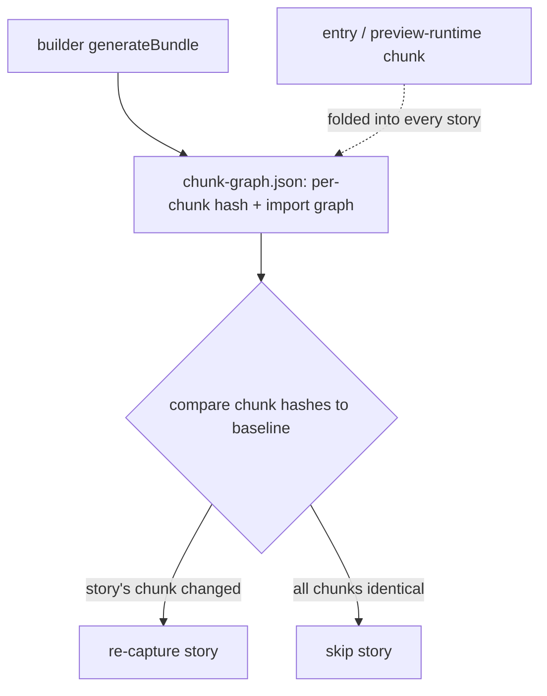

# Hash-based TurboSnap — Strategy C: chunk-diff (builder-emitted chunk graph)

> Part of the [hash-based TurboSnap research](./hash-based-turbosnap.md). Read the main doc
> first for the goal, the hashing/diff core, the shared section, and the strategy decision.
> **This document only covers what's specific to strategy C.**

**Strategy C diffs the builder's *output chunks* instead of its source modules.** It's a
variant of [strategy B](./hash-based-turbosnap-strategy-b-builder-emit.md) — the builder
still emits the graph — but the **primitive is the post-bundle chunk**, not the module. The
builder emits per-chunk content hashes, the cross-chunk import graph, and the set of chunks
each story loads; TurboSnap re-captures a story when any chunk in its set changes hash.

The appeal: chunk hashes are **tree-shake-accurate by construction** (a chunk's bytes are
exactly what ships), and the chunk format is uniform across builders. The catch: chunk
identity and chunk hashes are noisy (hashed filenames, re-chunking), so the signal is only
usable with deliberate normalization — see the findings below.



## How it relates to strategies A and B

| | A — own-trace | B — module-emit | **C — chunk-emit** |
|---|---|---|---|
| Primitive | source files (esbuild inputs) | transformed **modules** | output **chunks** |
| Graph source | we bundle | builder plugin | builder plugin |
| Tree-shaking | from esbuild | mild over-capture¹ | exact (by construction) |
| Main risk | silent fidelity drift | over-capture of unused exports | hash/identity noise (needs normalization) |

¹ Strategy B hashes a module's transformed code *before* tree-shaking, so a change to a
tree-shaken-away export of a used module still busts the story — safe over-capture.

C and B are not exclusive: the builder can emit **both** (the prototype does). Module hashes
give precise per-story attribution and graph debuggability; chunk hashes give tree-shake
accuracy. A backend could prefer chunk hashes and fall back to module rollups.

## The emitted artifact

`chunk-graph.json`, alongside `preview-stats.json`:

```json
{
  "stories": {
    "./src/Button.stories.tsx": { "chunks": ["<key>", "<key>", "..."] }
  },
  "chunks": {
    "<stable-key>": {
      "fileName": "assets/Button.stories-A1b2C3d4.js",
      "hash": "ab12cd34ef56...",
      "imports": ["<key>", "..."],
      "dynamicImports": ["<key>", "..."]
    }
  }
}
```

- **Stable chunk key.** Output filenames embed a content hash, so they churn on every change.
  Each chunk is keyed by a **stable identity** (the hash of its module-id set) with the
  content hash carried separately, so a build-to-build diff can tell *"same chunk, new
  content"* apart from *re-chunking*.
- **Per-story chunk set.** The transitive closure over a story chunk's static imports, plus
  the **entry / preview-runtime chunk** folded in (the chunk-diff equivalent of the shared
  section — a preview/global change moves the runtime chunk and busts every story).

### The diff

```typescript
const changed = (story) =>
  // structural change in the chunk set (re-chunk), or any chunk's content hash moved
  !sameSet(prev.stories[story], curr.stories[story]) ||
  curr.stories[story].chunks.some((k) => prev.chunks[k]?.hash !== curr.chunks[k].hash);
```

## Prototype

Implemented in the **Storybook** builder (not the CLI), since that's where the bundle lives:
`@storybook/builder-vite`'s `pluginChunkStats` (branch
`claude/vite-plugin-turbosnap-pozq5x`), emitting `chunk-graph.json` at Rollup's
`generateBundle`. **Opt-in** via `STORYBOOK_CHUNK_GRAPH=1` so normal builds are unaffected.
It is emitted *alongside* the strategy-B module graph (`preview-stats.json` + per-module
`contentHash`) so the two can be diffed head-to-head on the same build.

## Head-to-head vs. module-level (strategy B)

Measured on this repo's own Storybook (115 stories), building twice per edit with the
modified `@storybook/builder-vite` and diffing each signal against the baseline build:

| Edit | B — module-level | C — chunk-level |
|---|---|---|
| `auth.stories.ts` (substantive) | 3 | **3** |
| `auth.stories.ts` (comment-only) | 0 | 0 |
| dependency change — **unused / dead code** | 1 | **0** |
| dependency change — **used / side-effecting** | 1 | 1 |
| `.storybook/preview.ts` (substantive) | 115 | 115 |
| `README.md` | 0 | 0 |

Both signals are reproducible (0 changes between two identical builds), and `chunk-graph.json`
is smaller than the module stats (≈88 KB vs ≈180 KB here). The two agree everywhere **except
tree-shaken dead code**, where chunk-level is more precise and module-level is more
conservative.

## Two findings that decide whether this is viable

### 1. Hashed filenames cascade — normalize before hashing (mandatory)

The first naive version hashed each chunk's shipped code as-is. A change to **one** story
busted **all 115**. Cause: the runtime chunk's `importFn` maps story IDs → hashed output
filenames; one story's new content → new filename → the runtime chunk's bytes change → and
the runtime chunk is folded into every story. A leaf edit cascades to the whole suite.

Fix: **normalize the chunk code before hashing** — strip the sourcemap reference and
neutralize hashed sibling-chunk filenames (`name-A1b2C3d4.js` → `name-[hash].js`). With that,
the same edit drops from 115 back to a precise **3**, matching module-level. This is the
non-negotiable version of the design's "chunk-hash stability" caveat: without it the signal
is unusable.

### 2. Tree-shaking is the real precision difference

Appending an **unused** export to a dependency a story imports:

- **chunk-level → 0.** The export is tree-shaken out of the bundle (confirmed: the marker
  never reaches `storybook-static/assets`), so the shipped chunk is byte-identical. Correct
  non-capture — dead code can't change a snapshot.
- **module-level → 1.** It hashes the module's transformed code *before* tree-shaking, so the
  dependent story busts. Safe over-capture.

When the dependency change is **not** dead (a side-effecting statement that survives
tree-shaking), chunk-level catches it precisely (→ 1). So chunk-diff strictly wins on
dead-code/unused-export edits; module-diff strictly wins on never-under-capturing.

## Caveats specific to strategy C

- **Hash normalization is load-bearing** (finding 1). Sourcemap refs and hashed sibling
  filenames must be stripped, or the runtime chunk cascades to everything.
- **Chunk identity must be stable** across builds (we key by module-set hash). Filename-based
  keys make every content change look like add/remove.
- **Topology / re-chunk changes.** If the chunking strategy itself changes (vendor-split
  tweak, a new manual chunk), many chunk sets shift at once and the diff conservatively busts
  the affected stories. The structural-set check above flags these rather than silently
  mis-attributing.
- **Shared-section selection.** Folding the *whole* entry chunk in is correct but coarse: the
  `importFn` routing map lives in the runtime chunk too, so adding/removing stories perturbs
  it. Normalization (finding 1) keeps a content-only edit from leaking through, but
  story-set changes still move it. A finer split (preview-annotations chunk vs. routing chunk)
  would tighten this.
- **Builder coverage.** Each builder needs a `generateBundle`-time emitter conforming to the
  shared `chunk-graph.json` schema (the prototype covers Vite only).

## Open questions specific to strategy C

- Whether to ship C **instead of** or **alongside** B. Alongside keeps module-level precision
  and debuggability while gaining chunk-level tree-shake accuracy; the cost is two artifacts.
- Whether the normalized chunk hash should instead be built from per-module rendered code
  (`RenderedChunk.modules[id].code`, post-tree-shake) to sidestep filename normalization
  entirely — at the cost of re-deriving chunk boundaries.
- How the backend stores/compares chunk graphs, and how `--untraced` maps onto chunks.
