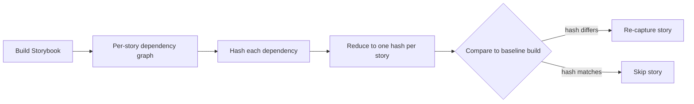
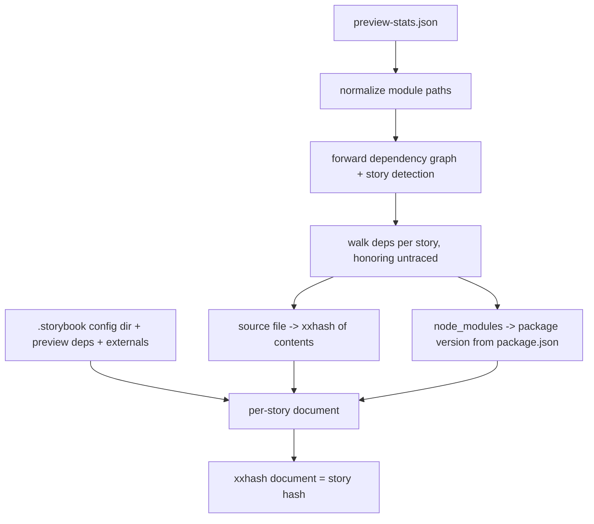

# Hash-based TurboSnap — research findings

> Status: **research / prototype**. Branch: `claude/story-dependency-hashing-tnevak`.
> Nothing here is wired into the production build or the `publishBuild` mutation yet.

This is the **shared overview**: the goal, the hashing/diff core, the key learnings, and
the decision between the implementation options. Each option has its own document with the
details specific to it — read this first, then dive into whichever you're working on:

- **[Strategy A — own-trace (esbuild)](./hash-based-turbosnap-strategy-a-own-trace.md)** —
  builder-agnostic fallback; we trace the graph ourselves.
- **[Strategy B — emit the graph from the builder](./hash-based-turbosnap-strategy-b-builder-emit.md)**
  — *recommended* for the builders we own (Vite, webpack5).
- **[Strategy C — chunk-diff (builder-emitted chunk graph)](./hash-based-turbosnap-strategy-c-chunk-diff.md)**
  — a B-variant that diffs output *chunks* instead of modules; tree-shake-accurate, but needs
  careful hash normalization. Sourced from the internal "chunk-diff" proposal — that doc
  [tracks our findings against it](./hash-based-turbosnap-strategy-c-chunk-diff.md#relationship-to-the-chunk-diff-proposal-notion).

## Goal

Replace TurboSnap's git-diff-based change detection with a **content-hash** approach:

1. For every story (CSF) file, compute the tree of source files it depends on.
2. Hash each dependency and reduce the whole tree to a **single hash per story**.
3. Compare a build's per-story hashes to a previous build's. **Any story whose hash
   changed needs to be re-captured** — no git diffing, no ancestry detection.

A shared "global" section (preview config, Storybook config, externals) is folded into
every story's hash, so changing a shared dependency busts every dependent story.



## TL;DR / recommendations

- **The hash approach works.** All prototypes produce stable per-story hashes that bust
  exactly when (and only when) a story's dependencies change — including dependencies
  shared with other stories, and including stories imported by other stories (CSF
  composition).
- **We need a complete, consistent dependency graph — today's stats aren't enough on their
  own.** The builder's `preview-stats.json` behaves differently across builders (webpack =
  complete, Vite = lossy and missing the preview's deps) and forces version-sniffing for
  node_modules. There are two ways to get a full, consistent graph: trace it ourselves with
  esbuild, or have the builder emit it. **The hashing/diff core is identical either way** —
  the only real decision is where the graph comes from.
- **Recommended production path:
  [emit the graph from the builders we own (strategy B)](./hash-based-turbosnap-strategy-b-builder-emit.md).**
  We maintain **2 of the 3 relevant builders** — Vite and webpack5 (Rspack is community-
  maintained). For those two, having the builder plugin emit a normalized graph **with
  per-module content hashes** gives the highest fidelity (resolution, TypeScript type-
  elision, and tree-shaking come from the real build for free) and a **loud** failure mode
  (a broken extractor fails in CI) rather than the *silent* fidelity drift of an own-trace.
- **Use the [esbuild own-trace (strategy A)](./hash-based-turbosnap-strategy-a-own-trace.md)
  as the validated fallback.** It's builder-agnostic, so it covers builders we don't own
  (e.g. Rspack) and any project whose builder hasn't been upgraded yet. It's also the
  prototype that already proved the hashing core is correct and consistent across builders.
- **Hash module/file contents; don't sniff versions.** Hashing the real dependency files
  (or builder-emitted per-module hashes) is more robust and less fragile than reading
  versions from `node_modules/**/package.json` — it catches version bumps, `patch-package`
  edits, and changed transitive resolutions alike.
- **A chunk-level variant ([strategy C](./hash-based-turbosnap-strategy-c-chunk-diff.md))
  is tree-shake-accurate and can ship alongside B.** Diffing the builder's output *chunks*
  (instead of modules) ignores dead-code/unused-export edits that module-level conservatively
  busts — but only once hashed filenames are normalized out, or a single-story edit cascades
  through the runtime chunk to the whole suite. A head-to-head found B and C agree on every
  tested edit except tree-shaken dead code.

## The hashing core, demonstrated (`hash-stories`)

The `hash-stories` prototype hashes on top of the existing builder `preview-stats.json`
(the same data the production tracer uses). It's the simplest of the three scripts and the
best illustration of the **shared mechanics both strategies build on** — per-story
hashing, the shared section, baseline diffing, and CSF composition.



**Output** (this repo's Vite build):

```
Hashed 115 story files:

  node-src/ui/components/icons.stories.ts [b6cd1d9ff46fc9da]
  node-src/ui/components/link.stories.ts [e41fdc1554cbacb2]
  node-src/ui/components/task.stories.ts [623608de44205d8b]
  node-src/ui/html/metadata.html.stories.ts [ef06e4a70b8da631]
```

The shared section (busts every story when changed):

```
Shared section (appended to every story, 3 entries):
  .storybook/main.ts [4cbe9e158562b0a7]
  .storybook/preview-head.html [a77ddb25a6085529]
  .storybook/preview.ts [e53e2cd5664d933e]
```

**Baseline diff** (`--baseline`) — the core decision. After editing `auth.stories.ts`:

```
Baseline diff: 3 stories need re-capture (3 changed, 0 added, 0 removed, 112 unchanged).
  ~ node-src/ui/tasks/auth.stories.ts
  ~ node-src/ui/workflows/uploadBuild.stories.ts
  ~ node-src/ui/workflows/uploadBuildE2E.stories.ts
```

Note the two workflow stories: they `import * as auth from '../tasks/auth.stories'`
(CSF composition), so a story file can be a dependency of other stories. The hash
approach handles this automatically because it traces real dependencies.

This prototype is conservative by construction: it inherits the builder stats' limitations
(on Vite, the preview's deps are missing) and collapses node_modules to a version string
rather than hashing them. Both options below exist to fix exactly those gaps.

## The prototype scripts

All three live in `bin-src/` and are registered as CLI subcommands. They are research
tools, not shipped features (`esbuild`/`oxc-*` are dynamically imported).

| Command | Graph source | Covered in |
|---|---|---|
| `chromatic hash-stories` | builder `preview-stats.json` | this doc (shared core demo) |
| `chromatic hash-stories-esbuild` | esbuild (own bundle) | [Strategy A](./hash-based-turbosnap-strategy-a-own-trace.md) |
| `chromatic trace-fidelity` | esbuild / oxc vs. stats | [Strategy A](./hash-based-turbosnap-strategy-a-own-trace.md) |

## The options

All strategies share the hashing/diff core demonstrated above; they differ in **where the
graph comes from** and **what primitive is hashed**:

| | A — own-trace (esbuild) | B — module-emit | C — chunk-emit |
|---|---|---|---|
| **Graph source** | We bundle stories ourselves and read the inputs | Builder plugins emit a module graph | Builder plugins emit a chunk graph |
| **Primitive hashed** | source files | transformed modules | output chunks |
| **Fidelity** | Must replicate each project's build config | Comes from the real build for free | Comes from the real build for free |
| **Failure mode** | *Silent* drift (risk: under-capture) | *Loud* (extractor breaks in CI) | *Loud*, but hash needs normalization |
| **Best for** | Builders we don't own (e.g. Rspack) | Builders we own (Vite, webpack5) | Builders we own; max tree-shake accuracy |
| **Details** | [Strategy A doc](./hash-based-turbosnap-strategy-a-own-trace.md) | [Strategy B doc](./hash-based-turbosnap-strategy-b-builder-emit.md) | [Strategy C doc](./hash-based-turbosnap-strategy-c-chunk-diff.md) |

**We own 2 of the 3 relevant builders (Vite and webpack5; Rspack is community-maintained),
so a builder-emit path (B, optionally C) is the recommended production path for the builders
we own, with strategy A as the fallback for the rest.** B and C are not exclusive — the
builder can emit both (the prototype does), and a [head-to-head shows they agree everywhere
except tree-shaken dead code](./hash-based-turbosnap-strategy-c-chunk-diff.md#head-to-head-vs-module-level-strategy-b).
Whichever the graph comes from, the downstream steps are the same:

1. **Hash module/file contents** rather than sniffing versions.
2. **Drive story enumeration from Storybook's story index** rather than the stats.
3. **`publishBuild` payload:** send the list of `{ storyFile, hash }`. Open question —
   send the shared section as one shared hash + per-story hashes, or fold it into each
   story hash (current prototypes do the latter).

### Benefits and drawbacks by option

> We're willing to take the harder option if it pays off long-term. The dimensions that
> matter most here are **monorepo robustness** and **debuggability** — the two areas where
> today's git-diff + lockfile-parsing TurboSnap is most finicky and opaque.

| Option | Benefits | Drawbacks | Effort |
|---|---|---|---|
| **A — own-trace (esbuild)** | Builder-agnostic — covers builders we don't own (Rspack) and not-yet-upgraded projects;<br>no builder changes to adopt;<br>already-validated prototype | Must replicate each project's build config (aliases, plugins) → **silent** fidelity drift → **under-capture risk** (skips a real visual change);<br>a second bundler to keep faithful forever;<br>**weakest in monorepos** with varied/custom configs;<br>**hardest to debug** (failures are silent) | Medium to adopt, **high** ongoing fidelity upkeep |
| **B — module-emit** *(recommended baseline)* | Highest fidelity — resolution, TS type-elision, tree-shaking come from the real build for free;<br>**loud** failure (breaks in CI, never silent);<br>per-module content hashes catch version bumps + `patch-package`;<br>**most debuggable** — exact "story X re-captured because module Y changed" attribution;<br>**monorepo-robust** — no git-baseline fetch, no lockfile parsing | Per-builder plugin to maintain (Vite, webpack5);<br>mild **over-capture** of changed-but-unused exports of used modules;<br>larger stats artifact | **Medium** — Vite done, webpack5 to do |
| **C — chunk-emit** *(layer on B for max precision)* | **Tree-shake-accurate** by construction — ignores dead-code / unused-export edits B would bust;<br>smaller artifact;<br>uniform chunk format across builders;<br>same monorepo/loud-failure wins as B | Hash **normalization is load-bearing** (hashed filenames cascade through the runtime chunk to every story if not stripped);<br>chunk identity must be stabilized;<br>topology / re-chunk changes can over-bust a batch;<br>**coarser attribution** than B (a chunk bundles many modules) — harder to explain *why* | **Medium-high** — normalization + stable keys; prototype Vite-only |

**Why every hash option helps the monorepo + debugging pain.** All three replace
git-diffing, shallow-clone-sensitive baseline fetches, and per-ecosystem lockfile parsing
with a single content-hash compare against the previous build's stored hashes. That removes
the failure modes that make TurboSnap finicky in monorepos and opaque when it misbehaves.
**B and C go further on debuggability and safety:** failures are *loud* (a broken extractor
fails the build in CI instead of silently under-capturing), and B in particular gives a
direct, per-module answer to "why did this story re-capture?" — which is exactly what's hard
to get today. The recommendation for the builders we own is therefore **B as the baseline,
with C layered on where tree-shaking precision is worth the extra normalization work**;
reserve A for builders we don't own.

## Key learnings

### Builder stats are not portable

- **Webpack** `preview-stats.json` is the real compiler graph — complete, includes the
  preview config and its dependencies.
- **Vite** stats are synthesized by a Rollup plugin (`storybook:rollup-plugin-webpack-stats`)
  that filters out the virtual modules the preview config is wired through. Result:
  `.storybook/preview.*` and its external dependencies are **absent** from the Vite graph.

This is why behavior diverges by builder, and why either a fuller builder-emitted graph
(strategy B) or an own-trace (strategy A) is needed. The Vite-side fix lives in the
[strategy B doc](./hash-based-turbosnap-strategy-b-builder-emit.md#what-the-plugins-need-to-change-vite-and-webpack5).

### How preview changes are handled today (for context)

Production TurboSnap **bails** (re-captures everything) when anything in the Storybook
config dir changes, and — on webpack — when a changed file traces up to a config file.
On Vite, preview's external deps are a pre-existing blind spot. The hash prototypes match
this conservatively by folding the whole `.storybook` dir into the shared section, and the
esbuild variant improves on it by tracing preview's real graph.

### Hashing files beats sniffing versions

`hash-stories` reads `node_modules/<pkg>/package.json` versions (nested-resolution aware).
That works and catches version bumps, but it can't see same-version content changes
(`patch-package`) and is more moving parts. Both options hash the actual content instead —
strategy A hashes the bundled dependency files, strategy B emits per-module content hashes
— so any change that affects the bundle is caught by construction.

### Stories can depend on stories

CSF composition (`import * as x from './other.stories'`) means story files are sometimes
dependencies of other stories. A dependency-tracing hash handles this for free; a naive
"a story only affects itself" model would not.

### A bare resolver is not enough

Resolution-only tracing (no TS type-elision, no tree-shaking) massively over-captures and
defeats TurboSnap's purpose. This is why the own-trace (strategy A) is built on esbuild
rather than a plain resolver; the measurements are in the
[strategy A doc](./hash-based-turbosnap-strategy-a-own-trace.md#trace-fidelity--is-an-own-trace-trustworthy).

### Hashing source files directly isn't sufficient (the original approach)

The original plan — list a story's dependencies and hash each **source file on disk** — is
correct for the common case (the prototypes do exactly this with xxhash and it holds for
most stories), but two gaps make raw-file hashing insufficient as the *sole* mechanism.
Both point to hashing the builder's **transformed module content**, driven by the real
bundled graph (strategy B), rather than raw files in isolation:

1. **You can't know *which* files to hash without the real bundled graph.** A file list
   produced by a resolver/parser over-captures badly (see *A bare resolver is not enough* —
   ~9,200 extra files from type-only imports and missing tree-shaking). The list must come
   from the post-elision, post-tree-shake build graph.
2. **Raw on-disk bytes miss build- and transform-driven changes.** A change can alter a
   story's rendered output *without changing any source file's bytes*:
   - a `define`/env value that gets inlined,
   - a Vite/webpack **plugin option** change,
   - an **alias retarget** (the same import resolves to a different file),
   - **asset / SVGR / CSS-modules** transform output changing for the same input.

   A raw-file hash sees none of these, so it can **under-capture** — skip a story that
   actually changed, which is the dangerous direction. Hashing the builder's *transformed*
   module content catches them because it hashes what was actually bundled. The raw-vs-
   transformed-vs-normalized trade-off and how to keep transformed hashes deterministic are
   in the [strategy B doc](./hash-based-turbosnap-strategy-b-builder-emit.md).

## Open questions (shared)

- Exact `publishBuild` schema and how the backend stores/compares baseline hashes.
- Whether the shared section is sent as one hash or folded into each story hash.

Option-specific open questions live in each strategy's doc.

## Running the scripts

```bash
# Build a Storybook with stats first (for hash-stories / story enumeration):
yarn build-storybook   # produces storybook-static/preview-stats.json

# 1. stats-based hashing (shared-core demo, this doc)
chromatic hash-stories -s storybook-static/preview-stats.json [--mode expanded] [--baseline base.json] [--json]

# 2. esbuild hashing with node_modules (strategy A)
chromatic hash-stories-esbuild -s storybook-static/preview-stats.json [--mode expanded] [--baseline base.json] [--json]

# 3. fidelity check (strategy A; oxc resolver requires: npm i oxc-parser oxc-resolver)
chromatic trace-fidelity -s storybook-static/preview-stats.json --resolver esbuild|oxc [--worst N] [--json]
```
