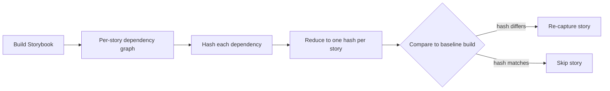
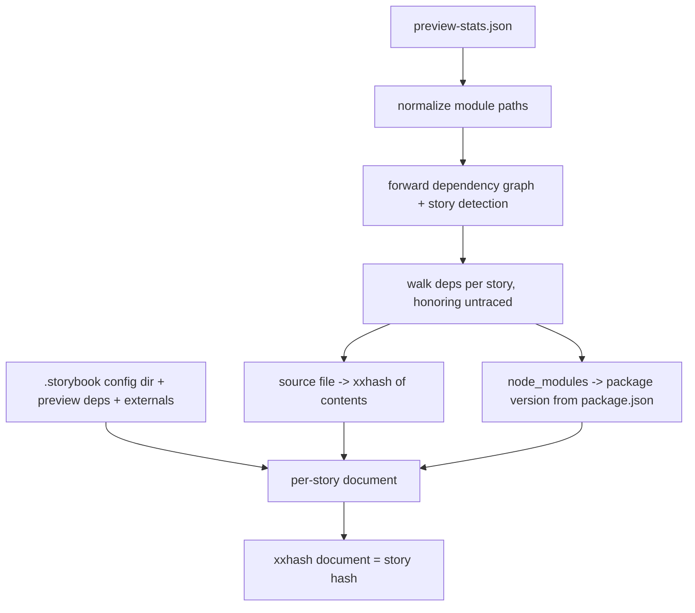
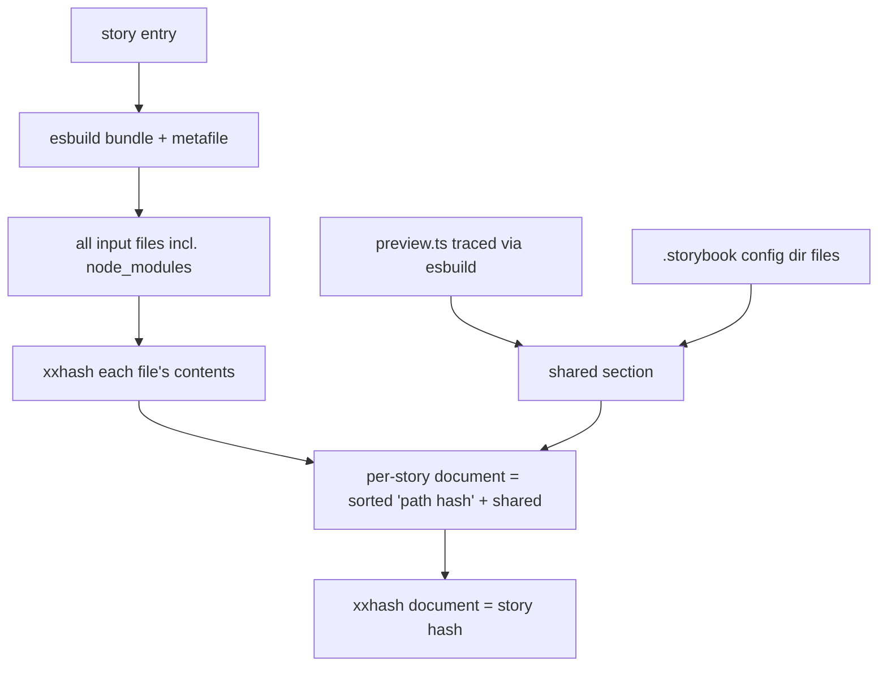
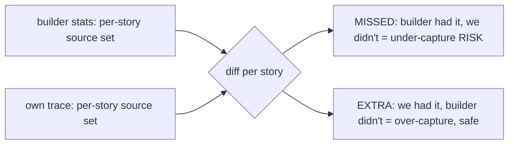
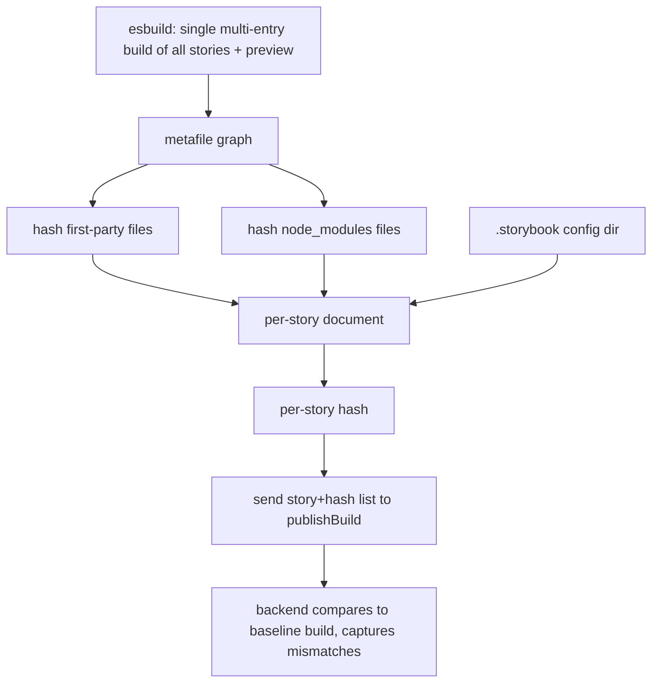

# Hash-based TurboSnap — research findings

> Status: **research / prototype**. Branch: `claude/story-dependency-hashing-tnevak`.
> Nothing here is wired into the production build or the `publishBuild` mutation yet.

## Goal

Replace TurboSnap's git-diff-based change detection with a **content-hash** approach:

1. For every story (CSF) file, compute the tree of source files it depends on.
2. Hash each dependency and reduce the whole tree to a **single hash per story**.
3. Compare a build's per-story hashes to a previous build's. **Any story whose hash
   changed needs to be re-captured** — no git diffing, no ancestry detection.

A shared "global" section (preview config, Storybook config, externals) is folded into
every story's hash, so changing a shared dependency busts every dependent story.



## TL;DR / recommendations

- **The hash approach works.** All prototypes produce stable per-story hashes that bust
  exactly when (and only when) a story's dependencies change — including dependencies
  shared with other stories, and including stories imported by other stories (CSF
  composition).
- **Prefer an esbuild-based tracer over the builder stats.** The builder's
  `preview-stats.json` behaves differently across builders (webpack = complete, Vite =
  lossy) and forces version-sniffing for node_modules. Tracing the graph ourselves with
  esbuild gives **one consistent behavior across builders**, closes the Vite preview-deps
  gap, and lets us hash node_modules **files** instead of guessing versions.
- **Hash node_modules files; don't sniff versions.** Bundling and hashing the real
  dependency files is more robust and less fragile than reading versions from
  `node_modules/**/package.json` — it catches version bumps, `patch-package` edits, and
  changed transitive resolutions alike.
- **A bare resolver (oxc) is not enough.** Resolution-only tracing massively over-captures
  because it can't do TypeScript type-elision or tree-shaking. esbuild does both for free
  and was perfectly faithful to the builder graph in testing.

## The three prototype scripts

All three live in `bin-src/` and are registered as CLI subcommands. They are research
tools, not shipped features (`esbuild`/`oxc-*` are dynamically imported).

| Command | Graph source | node_modules | Vite preview deps | Purpose |
|---|---|---|---|---|
| `chromatic hash-stories` | builder `preview-stats.json` | `package [version]` from package.json | missed (conservative fallback) | Hashing on top of the existing stats graph |
| `chromatic hash-stories-esbuild` | esbuild (own bundle) | actual files hashed | **captured** | Builder-agnostic hashing; the recommended direction |
| `chromatic trace-fidelity` | — | — | — | Measures whether an own-trace matches the builder graph |

---

## 1. `hash-stories` — hashing on the builder stats

Builds the dependency graph from `preview-stats.json` (the same data the production
tracer uses), then hashes per story.



**Output** (this repo's Vite build):

```
Hashed 115 story files:

  node-src/ui/components/icons.stories.ts [b6cd1d9ff46fc9da]
  node-src/ui/components/link.stories.ts [e41fdc1554cbacb2]
  node-src/ui/components/task.stories.ts [623608de44205d8b]
  node-src/ui/html/metadata.html.stories.ts [ef06e4a70b8da631]
```

`--mode expanded` shows the dependency tree, node_modules collapsed to `package [version]`:

```
node-src/ui/components/icons.stories.ts [b6cd1d9ff46fc9da]
  - node-src/ui/components/icons.ts [384a823f788fd4fc]
    - node_modules/chalk [4.1.2]
```

The shared section (busts every story when changed):

```
Shared section (appended to every story, 3 entries):
  .storybook/main.ts [4cbe9e158562b0a7]
  .storybook/preview-head.html [a77ddb25a6085529]
  .storybook/preview.ts [e53e2cd5664d933e]
```

**Baseline diff** (`--baseline`) — the core decision. After editing `auth.stories.ts`:

```
Baseline diff: 3 stories need re-capture (3 changed, 0 added, 0 removed, 112 unchanged).
  ~ node-src/ui/tasks/auth.stories.ts
  ~ node-src/ui/workflows/uploadBuild.stories.ts
  ~ node-src/ui/workflows/uploadBuildE2E.stories.ts
```

Note the two workflow stories: they `import * as auth from '../tasks/auth.stories'`
(CSF composition), so a story file can be a dependency of other stories. The hash
approach handles this automatically because it traces real dependencies.

---

## 2. `hash-stories-esbuild` — own trace with node_modules hashed (recommended direction)

Bundles each story with esbuild and hashes **every** input file — first-party and
node_modules — with no version sniffing. Also traces the preview config via esbuild,
which closes the Vite preview-deps gap.



**Output** — note node_modules files are real, hashed leaves (with transitive deps):

```
node-src/ui/components/icons.stories.ts [1daff1bafa1e960a] — 11 files (9 node_modules)
    node-src/ui/components/icons.stories.ts
    node-src/ui/components/icons.ts
    node_modules/ansi-styles/index.js
    node_modules/chalk/source/index.js
    node_modules/chalk/source/templates.js
    node_modules/chalk/source/util.js
    node_modules/color-convert/conversions.js
    node_modules/color-convert/index.js
    node_modules/color-convert/route.js
    node_modules/color-name/index.js
    node_modules/supports-color/browser.js

Shared section: 13 files (10 node_modules), appended to every story.
```

**Performance:** 115 stories hashed in ~2s, 0 bundle failures (per-story esbuild builds;
a production version would use a single multi-entry build + caching).

**Dependency-change detection** — editing `node_modules/chalk/source/index.js`:

```
Baseline diff: 115 need re-capture (115 changed, 0 added, 0 removed, 0 unchanged).
```

(chalk is used directly by most components and via the preview, so all 115 correctly
bust.) An unchanged baseline yields `0 need re-capture`.

---

## 3. `trace-fidelity` — is an own-trace trustworthy?

Before trusting an own-trace to replace the builder stats, this script quantifies the gap.
For each story it compares two **first-party source** dependency sets:

- **STATS** — what the builder actually bundled (ground truth).
- **OWN** — what our tracer (esbuild or oxc) finds.



**`--resolver esbuild`** (default): bundle + metafile; esbuild compiles TS and tree-shakes.

```
Checked 115 stories against the builder stats (resolver: esbuild).

  Dependency coverage:  100.0% of stats deps found by own-trace
  Stories with misses:  0 / 115
  Unique missed files:  0
  Stories the resolver could not trace: 0
```

`esbuild: coverage 1 | total stats deps 416 | total EXTRA 0 | max extra/story 0` — perfect.

**`--resolver oxc`**: `oxc-parser` (import extraction) + `oxc-resolver` (resolution only).

```
oxc: coverage 1 | total stats deps 416 | total EXTRA 9176 | max extra/story 217
```

100% coverage (0 missed) but **~9,200 EXTRA** files — massive over-capture, concentrated
in a long tail (median 0/story, max 217). Root causes a bare resolver can't handle:

1. **Type-only imports written without the `type` keyword**, e.g.
   `import { Context } from '../types'` where `Context` is an interface. esbuild does
   TS-aware elision and drops it; a syntactic tracer follows it into the type barrel
   (`types.ts`) and pulls in the whole app graph (`git/*`, `bin-src/*`, …).
2. **Tree-shaking** of unused exports (especially through barrel files).

**Conclusion:** an external tracer is viable, but it needs bundler-grade TS elision +
tree-shaking. esbuild provides both for free; resolution alone over-captures badly enough
to defeat TurboSnap's purpose.

---

## Key learnings

### Builder stats are not portable

- **Webpack** `preview-stats.json` is the real compiler graph — complete, includes the
  preview config and its dependencies.
- **Vite** stats are synthesized by a Rollup plugin (`storybook:rollup-plugin-webpack-stats`)
  that filters out the virtual modules the preview config is wired through. Result:
  `.storybook/preview.*` and its external dependencies are **absent** from the Vite graph.

This is why behavior diverges by builder, and why an own-trace (or a fuller stats file) is
attractive.

### How preview changes are handled today (for context)

Production TurboSnap **bails** (re-captures everything) when anything in the Storybook
config dir changes, and — on webpack — when a changed file traces up to a config file.
On Vite, preview's external deps are a pre-existing blind spot. The hash prototypes match
this conservatively by folding the whole `.storybook` dir into the shared section, and the
esbuild variant improves on it by tracing preview's real graph.

### Hashing files beats sniffing versions

`hash-stories` reads `node_modules/<pkg>/package.json` versions (nested-resolution aware).
That works and catches version bumps, but it can't see same-version content changes
(`patch-package`) and is more moving parts. `hash-stories-esbuild` hashes the actual
bundled dependency files, so any change that affects the bundle is caught by construction.

### Stories can depend on stories

CSF composition (`import * as x from './other.stories'`) means story files are sometimes
dependencies of other stories. A dependency-tracing hash handles this for free; a naive
"a story only affects itself" model would not.

## Recommended path forward



1. **Adopt esbuild as the dependency tracer** (one behavior across builders; closes the
   Vite gap; hashes node_modules files). Drive it from Storybook's story index rather than
   the stats for story enumeration.
2. **Hash node_modules files** rather than sniffing versions.
3. **Performance:** switch from per-story builds to one multi-entry build, and cache file
   hashes across builds.
4. **`publishBuild` payload:** send the list of `{ storyFile, hash }`. Open question —
   send the shared section as one shared hash + per-story hashes, or fold it into each
   story hash (current prototypes do the latter).

## Open questions

- Fidelity on non-vanilla setups: SVGR, CSS modules, `?raw`/`?url`, Vue/Svelte SFCs.
  `trace-fidelity` is the tool to measure this per project before trusting an own-trace.
- How to faithfully apply the user's bundler config (aliases, plugins) to the esbuild
  trace, or whether to read the builder's own module graph instead.
- Exact `publishBuild` schema and how the backend stores/compares baseline hashes.

## Running the scripts

```bash
# Build a Storybook with stats first (for hash-stories / story enumeration):
yarn build-storybook   # produces storybook-static/preview-stats.json

# 1. stats-based hashing
chromatic hash-stories -s storybook-static/preview-stats.json [--mode expanded] [--baseline base.json] [--json]

# 2. esbuild hashing with node_modules (requires esbuild, present transitively)
chromatic hash-stories-esbuild -s storybook-static/preview-stats.json [--mode expanded] [--baseline base.json] [--json]

# 3. fidelity check (oxc resolver requires: npm i oxc-parser oxc-resolver)
chromatic trace-fidelity -s storybook-static/preview-stats.json --resolver esbuild|oxc [--worst N] [--json]
```
