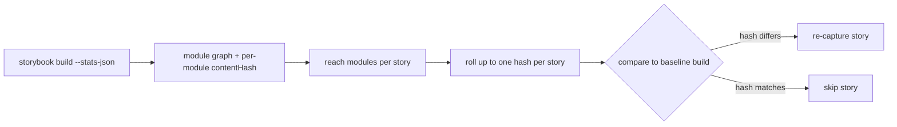

# Hash-based TurboSnap — module-hash strategy

> Status: **prototype**. Not yet wired into the production build or the `publishBuild` mutation.

This replaces TurboSnap's git-diff-based change detection with a **content-hash** approach, using
a single primitive: the **per-module content hash** emitted by the builder.

## Goal

1. For every story (CSF) file, find the modules it transitively depends on.
2. Roll those modules' content hashes up to a **single hash per story**.
3. Compare a build's per-story hashes to a previous build's. **Any story whose hash changed needs
   to be re-captured** — no git diffing, no lockfile parsing, no baseline checkout.

A shared "preview" section (the `.storybook/preview.*` config and everything it imports) is folded
into every story's hash, so changing a shared dependency busts every dependent story.



## How it works

The hash material comes entirely from the builder. `@storybook/builder-vite` emits a complete
module graph in `preview-stats.json` where every module carries a normalized, post-transform
`contentHash`. The CLI's whole job is a graph rollup:

```
storyHash(S) = H( sorted (moduleId, contentHash) over modules reachable from S + shared section )
```

- **Module graph + content hashes come from the real build**, so resolution, TypeScript
  type-elision, and tree-shaking are accounted for free — no second bundler to keep faithful.
- **Hashing content beats sniffing versions.** A per-module content hash catches version bumps,
  `patch-package` edits, and changed transitive resolution alike — node_modules are just modules in
  the graph.
- **The shared section** is everything reachable from `.storybook/preview.*`. The Vite plugin now
  bridges through its internal virtual modules so `.storybook/preview.*` is part of the graph (the
  "preview gap" fix) rather than being orphaned out of it.

### Capture characterization

- **Under-capture: ~zero** for in-graph inputs — any module whose content changes re-hashes every
  dependent story.
- **Over-capture: mild and safe** — a whitespace/comment change, or a change to a tree-shaken-away
  export of a *used* module, invalidates without a pixel change. (Closing this is the job of the
  chunk-level signal, which is intentionally **out of scope** here.)
- **Out-of-graph residue** — `.storybook/main.*` (never in the preview bundle), static dirs, and
  `preview-head.html` are not modules in the graph and are not covered by this signal; the existing
  TurboSnap handling for those still applies.

## Try it

The Storybook side requires the `@storybook/builder-vite` change that emits the complete graph with
per-module `contentHash` (branch `cody/hash-based-turbosnap`).

```bash
# 1. Build with stats, save the baseline hashes
storybook build --stats-json                                  # → storybook-static/preview-stats.json
chromatic hash-stories -s storybook-static/preview-stats.json --json > base.json

# 2. Make a change, rebuild, then diff against the baseline
storybook build --stats-json
chromatic hash-stories -s storybook-static/preview-stats.json --baseline base.json
```

`hash-stories` prints the per-story hashes and the shared section; with `--baseline` it reports the
`changed` / `added` / `removed` stories (the ones that need re-capture), or `--json` for
machine-readable output.

## What the production path still needs

This prototype diffs two local `--json` outputs. Production needs the backend to **persist each
build's per-story hash manifest** and the next build to fetch the baseline build's manifest and diff
maps — no git, no lockfiles. Open items:

- The exact `publishBuild` schema (per-story hashes, and whether to also send per-module hashes for
  "why did story X re-capture?" debugging).
- Version the hash payload (algorithm + normalization id) so an incompatible baseline triggers a
  capture-all rather than a silently wrong compare.
- A migration-window capture-all when the ancestor build predates stored hashes.
