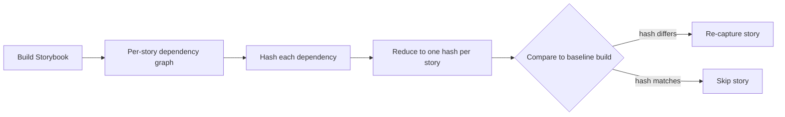
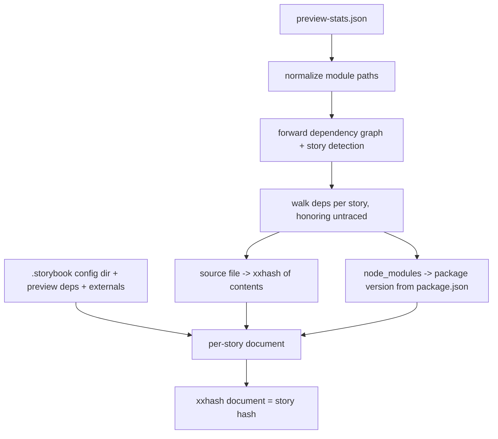
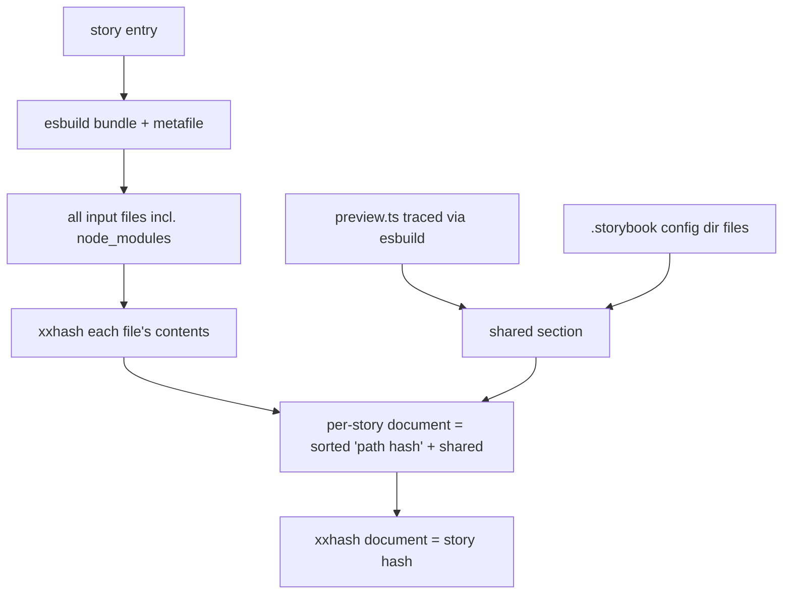
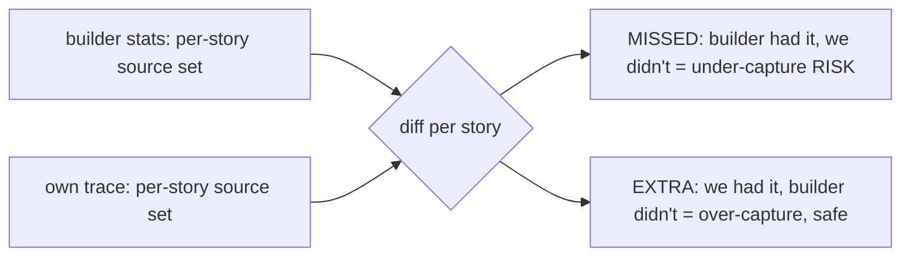
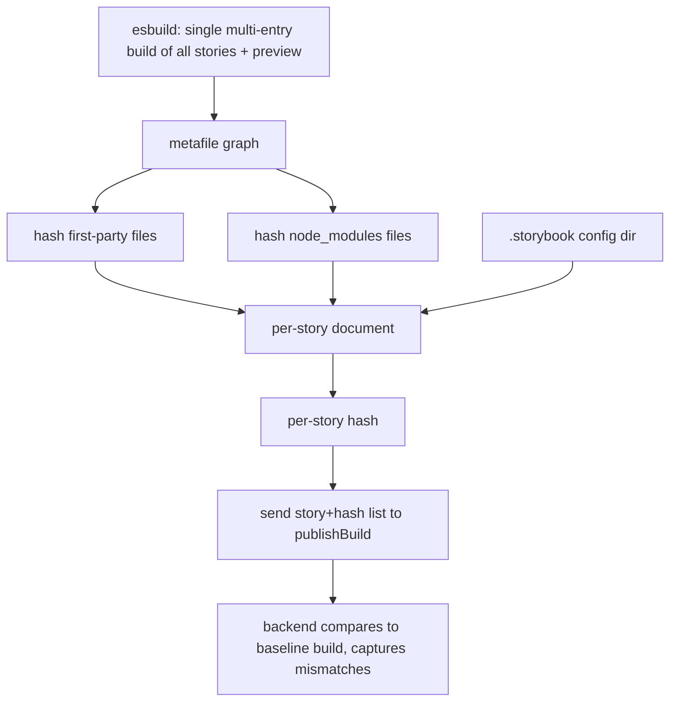
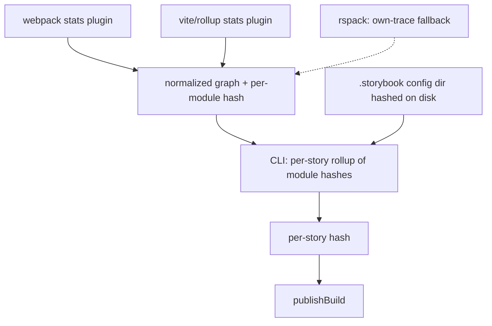

# Hash-based TurboSnap — research findings

> Status: **research / prototype**. Branch: `claude/story-dependency-hashing-tnevak`.
> Nothing here is wired into the production build or the `publishBuild` mutation yet.

## Goal

Replace TurboSnap's git-diff-based change detection with a **content-hash** approach:

1. For every story (CSF) file, compute the tree of source files it depends on.
2. Hash each dependency and reduce the whole tree to a **single hash per story**.
3. Compare a build's per-story hashes to a previous build's. **Any story whose hash
   changed needs to be re-captured** — no git diffing, no ancestry detection.

A shared "global" section (preview config, Storybook config, externals) is folded into
every story's hash, so changing a shared dependency busts every dependent story.



## TL;DR / recommendations

- **The hash approach works.** All prototypes produce stable per-story hashes that bust
  exactly when (and only when) a story's dependencies change — including dependencies
  shared with other stories, and including stories imported by other stories (CSF
  composition).
- **We need a complete, consistent dependency graph — today's stats aren't enough on their
  own.** The builder's `preview-stats.json` behaves differently across builders (webpack =
  complete, Vite = lossy and missing the preview's deps) and forces version-sniffing for
  node_modules. There are two ways to get a full, consistent graph: trace it ourselves with
  esbuild, or have the builder emit it. **Both were prototyped, and the hashing/diff core is
  identical either way** — the only real decision is where the graph comes from.
- **Recommended production path: emit the graph from the builders we own (strategy B).** We
  maintain **2 of the 3 relevant builders** — Vite and webpack5 (Rspack is community-
  maintained). For those two, having the builder plugin emit a normalized graph **with
  per-module content hashes** gives the highest fidelity (resolution, TypeScript type-
  elision, and tree-shaking come from the real build for free) and a **loud** failure mode
  (a broken extractor fails in CI) rather than the *silent* fidelity drift of an own-trace.
  This is the same class of per-builder maintenance TurboSnap already carries.
- **Use the esbuild own-trace (strategy A) as the validated fallback.** It's builder-
  agnostic, so it covers builders we don't own (e.g. Rspack) and any project whose builder
  hasn't been upgraded yet. It's also the prototype that already proved the hashing core is
  correct and consistent across builders.
- **Hash module/file contents; don't sniff versions.** Hashing the real dependency files
  (or builder-emitted per-module hashes) is more robust and less fragile than reading
  versions from `node_modules/**/package.json` — it catches version bumps, `patch-package`
  edits, and changed transitive resolutions alike.
- **A bare resolver (oxc) is not enough.** Resolution-only tracing massively over-captures
  because it can't do TypeScript type-elision or tree-shaking. esbuild does both for free
  and was perfectly faithful to the builder graph in testing — which is why strategy A is
  built on esbuild rather than a plain resolver.

## The three prototype scripts

All three live in `bin-src/` and are registered as CLI subcommands. They are research
tools, not shipped features (`esbuild`/`oxc-*` are dynamically imported). Together they
validate the hashing core and quantify the trade-off between the two graph sources.

| Command | Graph source | node_modules | Vite preview deps | Purpose |
|---|---|---|---|---|
| `chromatic hash-stories` | builder `preview-stats.json` | `package [version]` from package.json | missed (conservative fallback) | Hashing on top of the existing stats graph |
| `chromatic hash-stories-esbuild` | esbuild (own bundle) | actual files hashed | **captured** | Builder-agnostic own-trace (strategy A) |
| `chromatic trace-fidelity` | — | — | — | Measures whether an own-trace matches the builder graph |

---

## 1. `hash-stories` — hashing on the builder stats

Builds the dependency graph from `preview-stats.json` (the same data the production
tracer uses), then hashes per story.



**Output** (this repo's Vite build):

```
Hashed 115 story files:

  node-src/ui/components/icons.stories.ts [b6cd1d9ff46fc9da]
  node-src/ui/components/link.stories.ts [e41fdc1554cbacb2]
  node-src/ui/components/task.stories.ts [623608de44205d8b]
  node-src/ui/html/metadata.html.stories.ts [ef06e4a70b8da631]
```

`--mode expanded` shows the dependency tree, node_modules collapsed to `package [version]`:

```
node-src/ui/components/icons.stories.ts [b6cd1d9ff46fc9da]
  - node-src/ui/components/icons.ts [384a823f788fd4fc]
    - node_modules/chalk [4.1.2]
```

The shared section (busts every story when changed):

```
Shared section (appended to every story, 3 entries):
  .storybook/main.ts [4cbe9e158562b0a7]
  .storybook/preview-head.html [a77ddb25a6085529]
  .storybook/preview.ts [e53e2cd5664d933e]
```

**Baseline diff** (`--baseline`) — the core decision. After editing `auth.stories.ts`:

```
Baseline diff: 3 stories need re-capture (3 changed, 0 added, 0 removed, 112 unchanged).
  ~ node-src/ui/tasks/auth.stories.ts
  ~ node-src/ui/workflows/uploadBuild.stories.ts
  ~ node-src/ui/workflows/uploadBuildE2E.stories.ts
```

Note the two workflow stories: they `import * as auth from '../tasks/auth.stories'`
(CSF composition), so a story file can be a dependency of other stories. The hash
approach handles this automatically because it traces real dependencies.

**Limitation that motivates the other prototypes:** the stats graph is only as good as the
builder that produced it. On Vite it's missing the preview's dependencies, and node_modules
are collapsed to a version string rather than hashed — so this prototype is conservative by
construction (see [Key learnings](#key-learnings)).

---

## 2. `hash-stories-esbuild` — own-trace with node_modules hashed (strategy A)

Bundles each story with esbuild and hashes **every** input file — first-party and
node_modules — with no version sniffing. Also traces the preview config via esbuild,
which closes the Vite preview-deps gap. This is the builder-agnostic **strategy A**
prototype: it proves the hashing core works without depending on builder stats.



**Output** — note node_modules files are real, hashed leaves (with transitive deps):

```
node-src/ui/components/icons.stories.ts [1daff1bafa1e960a] — 11 files (9 node_modules)
    node-src/ui/components/icons.stories.ts
    node-src/ui/components/icons.ts
    node_modules/ansi-styles/index.js
    node_modules/chalk/source/index.js
    node_modules/chalk/source/templates.js
    node_modules/chalk/source/util.js
    node_modules/color-convert/conversions.js
    node_modules/color-convert/index.js
    node_modules/color-convert/route.js
    node_modules/color-name/index.js
    node_modules/supports-color/browser.js

Shared section: 13 files (10 node_modules), appended to every story.
```

**Dependency-change detection** — editing `node_modules/chalk/source/index.js`:

```
Baseline diff: 115 need re-capture (115 changed, 0 added, 0 removed, 0 unchanged).
```

(chalk is used directly by most components and via the preview, so all 115 correctly
bust.) An unchanged baseline yields `0 need re-capture`.

This prototype bundles **per story**; a production version would use a single multi-entry
build plus caching. See [Performance / scaling](#performance--scaling-strategy-a-own-trace)
for what that costs and why it only applies to strategy A.

---

## 3. `trace-fidelity` — is an own-trace trustworthy?

Strategy A only works if an own-trace faithfully reproduces what the builder bundled. This
script quantifies the gap before we trust it. For each story it compares two **first-party
source** dependency sets:

- **STATS** — what the builder actually bundled (ground truth).
- **OWN** — what our tracer (esbuild or oxc) finds.



**`--resolver esbuild`** (default): bundle + metafile; esbuild compiles TS and tree-shakes.

```
Checked 115 stories against the builder stats (resolver: esbuild).

  Dependency coverage:  100.0% of stats deps found by own-trace
  Stories with misses:  0 / 115
  Unique missed files:  0
  Stories the resolver could not trace: 0
```

`esbuild: coverage 1 | total stats deps 416 | total EXTRA 0 | max extra/story 0` — perfect.

**`--resolver oxc`**: `oxc-parser` (import extraction) + `oxc-resolver` (resolution only).

```
oxc: coverage 1 | total stats deps 416 | total EXTRA 9176 | max extra/story 217
```

100% coverage (0 missed) but **~9,200 EXTRA** files — massive over-capture, concentrated
in a long tail (median 0/story, max 217). Root causes a bare resolver can't handle:

1. **Type-only imports written without the `type` keyword**, e.g.
   `import { Context } from '../types'` where `Context` is an interface. esbuild does
   TS-aware elision and drops it; a syntactic tracer follows it into the type barrel
   (`types.ts`) and pulls in the whole app graph (`git/*`, `bin-src/*`, …).
2. **Tree-shaking** of unused exports (especially through barrel files).

**Conclusion:** an own-trace is viable, but it needs bundler-grade TS elision +
tree-shaking. esbuild provides both for free; resolution alone over-captures badly enough
to defeat TurboSnap's purpose. This is why strategy A is built on esbuild — and why, when
the build already has this information, having the builder emit it (strategy B) is even
better.

---

## Key learnings

### Builder stats are not portable

- **Webpack** `preview-stats.json` is the real compiler graph — complete, includes the
  preview config and its dependencies.
- **Vite** stats are synthesized by a Rollup plugin (`storybook:rollup-plugin-webpack-stats`)
  that filters out the virtual modules the preview config is wired through. Result:
  `.storybook/preview.*` and its external dependencies are **absent** from the Vite graph.

This is why behavior diverges by builder, and why either a fuller builder-emitted graph
(strategy B, for the builders we own) or an own-trace (strategy A) is needed.

### How preview changes are handled today (for context)

Production TurboSnap **bails** (re-captures everything) when anything in the Storybook
config dir changes, and — on webpack — when a changed file traces up to a config file.
On Vite, preview's external deps are a pre-existing blind spot. The hash prototypes match
this conservatively by folding the whole `.storybook` dir into the shared section, and the
esbuild variant improves on it by tracing preview's real graph.

### Hashing files beats sniffing versions

`hash-stories` reads `node_modules/<pkg>/package.json` versions (nested-resolution aware).
That works and catches version bumps, but it can't see same-version content changes
(`patch-package`) and is more moving parts. `hash-stories-esbuild` hashes the actual
bundled dependency files, so any change that affects the bundle is caught by construction.
The builder-emitted approach (strategy B) gets the same property from per-module content
hashes.

### Stories can depend on stories

CSF composition (`import * as x from './other.stories'`) means story files are sometimes
dependencies of other stories. A dependency-tracing hash handles this for free; a naive
"a story only affects itself" model would not.

## Recommended path forward

Both strategies share the same hashing/diff core; they differ only in **where the
dependency graph (and per-module content) comes from**:

- **A — Own-trace (esbuild).** Builder-independent: we trace the graph ourselves.
  Trade-off: we must faithfully replicate each project's build config (aliases, plugins),
  and fidelity drift is *silent* (a missed dependency = a real visual change skipped).
- **B — Emit the graph from the builder.** Builder plugins emit a normalized graph (with
  per-module content hashes); the CLI does pure rollup + diff. Highest fidelity
  (resolution / type-elision / tree-shaking come from the real build for free) and
  breakage is *loud* (a broken extractor fails in CI).

**We own 2 of the 3 relevant builders — Vite and webpack5 (Rspack is community-maintained) —
so strategy B is the recommended production path for the builders we own, with strategy A as
the fallback for builders we don't.** See
[Preferred direction](#preferred-direction-emit-the-graph-from-the-builder) for the plugin
details.

The diagram below shows the **strategy A (own-trace)** flow; strategy B replaces the
esbuild front-end with a builder-emitted graph, and everything from "per-story document"
onward is shared between them.



Concretely:

1. **Emit a normalized graph + per-module content hashes from the builder plugins** for the
   builders we own; fall back to the esbuild own-trace for builders we don't.
2. **Hash module/file contents** rather than sniffing versions, regardless of graph source.
3. **Drive story enumeration from Storybook's story index** rather than the stats.
4. **`publishBuild` payload:** send the list of `{ storyFile, hash }`. Open question —
   send the shared section as one shared hash + per-story hashes, or fold it into each
   story hash (current prototypes do the latter).

## Preferred direction: emit the graph from the builder

We maintain 2 of the 3 relevant builders (Vite and webpack5), so keeping per-builder
plugins up to date is acceptable — which makes strategy **B** the preferred production path
for those builders. It stays builder-*dependent*, but the coupling is isolated to thin
per-builder adapters that emit one normalized format; everything downstream is a single
builder-agnostic algorithm. The esbuild own-trace (strategy A) remains the fallback for
Rspack and any builder we don't own.



Why builder-dependence is acceptable here: the failure mode is *loud* (extraction fails or
the format changes — caught in CI), there are only 3 relevant builders (Vite, webpack5,
Rspack) and they're consolidating toward Vite/Rolldown, and it's the **same class of
maintenance TurboSnap already carries**. The own-trace alternative trades that for *silent*
fidelity drift per project (under-capture = a real visual change skipped), which is worse —
so we reserve it for the builders where we have no other option.

### What the plugins need to change (Vite and webpack5)

1. **Vite: stop dropping virtual-bridged edges (the preview gap).** In
   `@storybook/builder-vite`, `pluginWebpackStats` gates the graph through `isUserCode`,
   which excludes `\0`-prefixed virtual modules unless they're in a small allowlist. The
   chain to `.storybook/preview.*` and addon `preview` entries runs through the
   project-annotations / config-entry virtual, which is **not** in that allowlist — so
   those edges are dropped and `preview.*` is orphaned out of the stats (this is the Vite
   preview-deps gap from §"Builder stats are not portable"). Fix: build the graph from
   Rollup's complete module info at `buildEnd` (`getModuleIds()` → `getModuleInfo(id)`),
   bridging *through* virtual modules (connect a virtual's real importers to its real
   imports) instead of filtering them out. This brings Vite to parity with webpack.
2. **Keep node_modules *files* in the graph** (already true for both builders) with stable
   resolved paths, so dependencies can be hashed at the file level — no version sniffing.
3. **Emit a stable per-module content hash** (detailed below) — the highest-leverage
   change.
4. **Normalize the schema across builders** so the downstream algorithm is single-path,
   e.g. `{ id, path, kind: 'source' | 'node_module' | 'external', importers: string[],
   contentHash? }`. Webpack/Rspack stats are already complete; the work is conforming to
   the schema.
5. **Out of band:** `.storybook/main.*` and manager/Node-side config never appear in the
   preview bundle graph, so keep hashing the `.storybook` config dir from disk (or add a
   separate manager-side stats).

### (3) Per-module content hashing — detail

This is the change that collapses the CLI to a pure graph-rollup and removes every
fidelity problem. If each module in the graph carries a stable content hash, the CLI no
longer resolves imports, reads files, runs a second bundler, or sniffs node_modules
versions. Its whole job becomes:

```
storyHash(S) = H( sorted [(moduleId, moduleHash) for module in reachable(S)] + sharedSection )
```

…then diff `storyHash` maps against the baseline build.

**What to hash (the crux).** "Content hash" can mean three things, and the choice
determines correctness and stability:

| Option | Captures | Risk |
|---|---|---|
| Raw on-disk source bytes | source edits | misses config/transform-driven changes (a `define` value, plugin option, alias retarget, SVGR output) |
| Post-transform module code | the *actual bundled output* (best signal) | machine-dependent noise (absolute paths, sourcemap refs, timestamps) |
| **Post-transform code, normalized** (recommended) | bundled output | — (noise stripped before hashing) |

Normalize before hashing: strip absolute project/home paths → repo-relative, drop
sourcemap comments/inline maps, and be deliberate about `define`/env inlining (env that
affects visuals *should* invalidate; CI-noise env like build IDs should be excluded or
hashed pre-`define`).

**Where the material already exists** — this is cheap in both builders we own:

- **Rollup/Vite:** `ModuleInfo.code` is the transformed code per module. At `buildEnd`,
  iterate `getModuleIds()` → `getModuleInfo(id).code`, normalize, hash, emit alongside
  `importers`.
- **webpack:** it already computes content-based module hashes for `[contenthash]`
  (`chunkGraph.getModuleHash` / `module.buildInfo.hash`); surface those (confirm they're
  content- not identity-derived, and runtime-stable).

Use xxhash64 (fast, non-crypto; 128-bit if extra collision margin is wanted) — negligible
cost next to the build.

**Edge cases:**

- **Virtual modules** (no file): hash their *generated* content (the plugin produced it).
  Desirable — the stories-list virtual changes when stories are added/removed.
- **node_modules:** hashed like any module → catches version bumps, `patch-package` edits,
  and changed transitive resolution, with no version string to trust.
- **Assets / CSS:** hash the transform output (URL, base64, injected CSS) → captures
  asset/style changes that affect rendering.
- **Granularity:** hashing the whole module means a change to a tree-shaken-away export of
  a *used* module still invalidates — mild, safe over-capture; per-export precision isn't
  worth it.

**Capture characterization:**

- **Under-capture: ~zero.** Any in-graph input whose content changes re-hashes every
  dependent story.
- **Over-capture: mild, safe.** Whitespace/comment-only changes, or changes to unused
  exports of used modules, invalidate without pixel changes.
- The only under-capture surface is anything affecting rendering that **isn't a module in
  the graph** — global CSS injected via `preview-head.html`, fonts, runtime-fetched data —
  which is why the `.storybook` config dir is still folded in (point 5).

**Optional:** the plugin could emit per-story hashes directly, making the CLI a pure
pass-through to `publishBuild`. Still emit **module-level** hashes too, for flexible
backend rollups and for debuggability ("story X re-captured because module Y changed").

The one subtle thing to get right is the **normalization of transformed code** so the hash
is deterministic across machines and CI.

## Performance / scaling (strategy A own-trace)

> **Scope:** these numbers measure the **esbuild own-trace prototype (strategy A)** —
> specifically the cost of *bundling stories to trace them*. They do **not** apply to the
> recommended strategy B: there the graph and per-module hashes come out of the build
> Storybook already runs, so there is no separate trace step and the marginal cost is just
> hashing + diff. This section sizes the fallback path and motivates a single multi-entry
> build if/when we ship the own-trace.

Building the `storybookjs/storybook` monorepo's internal Storybook wasn't practical in the
research environment (Nx + yarn workspaces, and the esbuild tracer needs the source tree
*with node_modules installed* to bundle). Instead, scaling was measured with a controlled
benchmark: N synthetic-but-realistic stories, each importing a component that pulls a real
node_modules graph (`chalk` + transitive deps, `ts-dedent`) — comparable to the ~11–15
files per real story observed in this repo. Cold runs, no caching.

| Stories | Single multi-entry build | Per-story loop (current script) |
|--------:|-------------------------:|--------------------------------:|
|     115 |     219 ms (1.9 ms/story) |            1,135 ms (9.9 ms/story) |
|     500 |     840 ms (1.7 ms/story) |            4,753 ms (9.5 ms/story) |
|   1,000 |   2,880 ms (2.9 ms/story) |           11,015 ms (11.0 ms/story) |
|   2,000 |  10,644 ms (5.3 ms/story) |           27,613 ms (13.8 ms/story) |

Takeaways (all specific to the own-trace path):

- **Per-story bundling** (what `hash-stories-esbuild` does today) scales roughly linearly
  at ~10–14 ms/story: a 2,000-story Storybook traces in ~28 s.
- **A single multi-entry build is ~2.5–5× faster** and is the production-relevant path for
  strategy A (it shares esbuild startup and graph work). 2,000 stories in ~11 s.
- File hashing (xxhash) is **not** the bottleneck — bundling dominates; the 115-story real
  run completes in ~2 s including hashing. Under strategy B, where bundling isn't a
  separate step, hashing is the only added cost — so it's effectively free.

Caveats: synthetic stories are smaller than many real-world stories, so real ms/story will
be higher; node_modules are re-parsed per entry here (a shared module graph / single build
amortizes that); and these are cold runs. In production we'd run once per build, cache file
hashes across builds, and only re-bundle changed entries — so steady-state cost is much
lower than these cold numbers.

## Open questions

- Fidelity on non-vanilla setups: SVGR, CSS modules, `?raw`/`?url`, Vue/Svelte SFCs.
  `trace-fidelity` is the tool to measure this per project before trusting the own-trace
  fallback.
- For the builders we own: confirming webpack's `[contenthash]` module hashes are content-
  (not identity-) derived and runtime-stable, and finalizing the normalized graph schema.
- Exact `publishBuild` schema and how the backend stores/compares baseline hashes.

## Running the scripts

```bash
# Build a Storybook with stats first (for hash-stories / story enumeration):
yarn build-storybook   # produces storybook-static/preview-stats.json

# 1. stats-based hashing
chromatic hash-stories -s storybook-static/preview-stats.json [--mode expanded] [--baseline base.json] [--json]

# 2. esbuild hashing with node_modules (requires esbuild, present transitively)
chromatic hash-stories-esbuild -s storybook-static/preview-stats.json [--mode expanded] [--baseline base.json] [--json]

# 3. fidelity check (oxc resolver requires: npm i oxc-parser oxc-resolver)
chromatic trace-fidelity -s storybook-static/preview-stats.json --resolver esbuild|oxc [--worst N] [--json]
```
